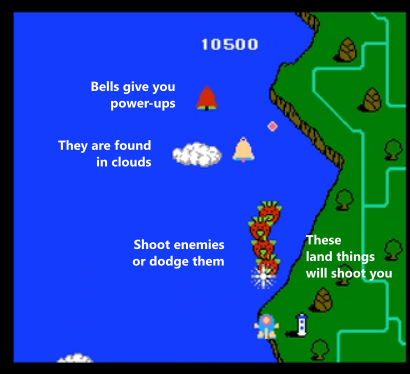

# NeXTCS Final Project
### Programmer 0: Verit Li
### Programmer 1: Tedd Lee
### Class period: 10
---
### Proposal: TwinBee

A vertical scrolling shooting game of one or two bees that shoot bells out of clouds to get power-ups and shoot random flying enemies and throw bombs at land sturctures that are mean. Includes bosses, scores, a selection interface, multiplayer (same computer), different enemy pathings and projectiles
https://www.retrogames.cz/play_009-NES.php?language=EN
#### Processing libraries: 
- Sound - for defeating enemies, hitting objects
#### Topics: 
- keyboard inputs for game controls
- using projectiles and hitboxes
- either arrays or arraylists to store enemies
- subclasses for different types of enemies
- some image processing for sprites
---
### Design Document
#### Classes:
- Projectile: Will model a bullet and keep its location. Will note the origin, user or enemy.
- Enemy: Will be the superclass for every obstacle- the different enemies will be subclasses, with collisions, displays, what to do ever frame, etc.
- Bell: Will model a bell and handle movement, powerup chances, bullet collision, etc.
- Player: The player! Can shoot bullets, throw bombs. (Movement is rather simple and will be controlled in a keypressed). 
- Cloud: Similar to an Enemy but it is harmless to the player. Has a chance of having a bell hidden inside. Collisions.
- Boss: Will be the superclass for a boss. Different bosses will be subclasses and have different movement, attacks, etc.

#### Concepts:
- Graphical output.
- Major control structures.
- Keyboard input.
- Subclasses and inheritance.
- 1D arrays.

#### User Interaction:
The user(s) will be controlling a character using WASD. They can shoot bullets and throw bombs through two other buttons. (TBD) We can also use a game controller. The character must avoid projectiles and shoot flying enemies as they fly through the sky. They can shoot bells out of clouds for a chance to gain a power up. Collecting bells and other things add to their score.

#### Libraries:
- Sound: to make the game more enjoyable and immersive.

#### Mock up:
##### Enemy types:
- Turnips: Diagonal, shoot when behind you
- Strawberry: Diagonal, can switch direction when xvals are same with player.
- Pepper: Diagonal, when close, slowly zooms off horizontally
- Grapes: Diagonal, when close, run away in a U shape, shoot
- Eggplant: Move down the screen in a row, then scatter horizontally

- Plates: Diagonal, swerves back up.
- Knives: Parabola, jump down to a point, shoot, then jump all the way down.
- Forks: Diagonal, get to a point, separate (3 or 4 at a time)
- Bowls: Plates, but option to shoot a bullet before swerving 
- Pots: Horizontal.
- Rice cooker: Circular, makes a fat w.

- Fires: Diagonal sine wave then loops in the middle.
- Crabs: Goes down on both sides, goes horizontal when it has same y val as the player.

The list goes on...

##### Gameplay examples:

